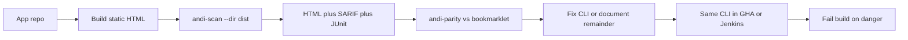

# First Workable ANDI CI Tool

> Working copy of the launch plan. Original Cursor plan file (not in this repo):
> `/Users/jarvis_arunlab/.cursor/plans/ANDI CI Launch Plan-745c4acd.plan.md`
>
> Status **2026-09-16:** Steps 1–5 are done. Step 6 (npm / GHCR / tag) waits
> for Arun’s publish approval. Parity numbers:
> [`validation/launch-parity-2026-09-16.md`](validation/launch-parity-2026-09-16.md).
> Next **product** (Docket, not this launch list):
> [`docket/PHASED-APPROACH.md`](docket/PHASED-APPROACH.md).

## Review: goal vs what is already built

The goal is a **shift-left ANDI gate**: install a CLI on a Mac, scan the site about to ship, compare it to the official SSA ANDI bookmarklet, then run that same scan in GitHub Actions or Jenkins so findings can block production.

That product is **mostly already in this repo**. Remaining work is not “build ANDI automation.” It is: make the existing tool **installable**, **comparable to manual ANDI**, **usable from someone else’s CI**, and **honest enough to donate**.

Already on `main` (CI green; docs refresh `2026-09-16`):

- Headless official ANDI via Playwright (`src/scanner.cjs`, `src/modules.cjs`, `src/extract.cjs`)
- Local repo scan after a build: `andi-scan --dir ./dist` (`src/directory.cjs`)
- CI outputs: text, JSON, SARIF, JUnit, HTML
- Bookmarklet comparator: `andi-parity` (`src/parity-cli.cjs`)
- Saved evidence: 20 public `.gov` pages, 160/160 modules, zero count delta vs live SSA bookmarklet
- GitHub composite action, Docker recipe, GitHub/GitLab/Jenkins snippets

What is **not** done (publish only):

- **Not installable as a stranger.** Unpublished on npm. Clone + Playwright works on this Mac.
- **`--dir` does not scan source.** Only rendered `.html`/`.htm`. Unbuilt source trees now get a build-first error.
- **GHCR / npm / tag do not exist.** No `release.yml`. Approval-gated.
- **“100% compliance” is the wrong promise.** The CLI can match ANDI alerts. It cannot certify Section 508.

## The v1 promise (scope freeze)

Ship one thing:

> This CLI runs official unmodified ANDI on a rendered page and fails CI when ANDI reports findings at a chosen severity. On the same rendered URL, CLI findings match the SSA bookmarklet.

Out of v1 (keep in repo, do not market or block launch): axe, auth/SPA crawling, sitemap-as-default, Match benchmarks, Trusted-Tester replacement.

Default scan: `--module all --fail-on danger`. Keep the honesty banner.

**“100%” for this plan:** same ANDI alerts as the bookmarklet for a given URL and module (`andi-parity --browser-source live --fail-on-diff`). Not 100% of Section 508.

## Developer path



Mac first hour (until npm exists):

```bash
git clone https://github.com/arunsanna/andi-cli && cd andi-cli
npm install
npx playwright install chromium

node src/cli.cjs --dir /path/to/your-app/dist --module all --fail-on danger \
  --html /tmp/andi.andi.html --sarif /tmp/andi.sarif

node src/parity-cli.cjs --url https://your-staging-or-localhost-page \
  --module all --browser-source live --fail-on-diff \
  --markdown-out /tmp/andi-parity.md
```

Then those same flags move into CI.

## Implementation steps

### 1. Restore the local Mac CLI (half day) — DONE 2026-09-14

Install Playwright Chromium 1193 including headless shell. Prove:

- `npm run test:fixture` exits 1
- `andi-scan --dir examples --module f --fail-on danger` finds the fixture
- local `andi-parity --serve-file examples/fixture.html --module all --browser-source local --fail-on-diff` is exact

Add a Mac first-hour section to `README.md`: Node 18+, Playwright install required, scan **build output** not source.

### 2. Freeze the claim language (quarter day) — DONE 2026-09-16

- Replaced stale `CLAUDE.md` (“focusable-only / do Phase 2”)
- Replaced stale `docs/RESUME.md`
- README / USAGE: CLI matches ANDI alerts; it does not replace Trusted Tester
- Added `docs/USAGE.md`, `docs/README.md`, architecture “at a glance”
- Marked `PLAN.md` and `research-thread.md` as historical

### 3. Make “scan my repository” foolproof (half day) — DONE 2026-09-16

If `--dir` has `package.json` but zero HTML, error: “Build the app, then scan
`dist/`, `build/`, or `out/`.” After a build, `--dir` on the project root
finds HTML under those folders. Build-then-scan is the primary Mac story
in README.

### 4. Close CLI vs manual ANDI gaps (1–2 days) — DONE 2026-09-16

`andi-parity` on the fixture: local **8/8 exact**, live SSA bookmarklet
**8/8 exact** (`http://127.0.0.1`, not `file://`). Dogfood
`https://www.section508.gov/test/`: live **8/8 exact**. Evidence:
`docs/validation/launch-parity-2026-09-16.md`. A visible-browser human
click was not repeated this session; the live side is SSA’s `andi.js`.

### 5. Fix the CI consumer path (1 day) — DONE 2026-09-16

- Action `dir` / `urls` resolve against `$GITHUB_WORKSPACE`
- `andi-scan` is on PATH in the Docker image; ENTRYPOINT is still the CLI
- Until GHCR exists, `docker build` from source (README / CI docs)

### 6. Package and donate (your approval only)

Add `release.yml`, then npm + GHCR + tag. Do not publish until you say go.

## Out of this slice

- New accessibility engines
- Login/session crawling
- Replacing Trusted Tester
- Broad refactors of `andi/` (never modify it)
- Playwright version bump
- Rewriting reporters

## Success

A government developer can install on a Mac, scan a built site, compare to the bookmarklet, paste one GHA or Jenkins snippet, and understand they automated ANDI — not a 508 certification.

Sequence: Mac CLI → claims → repo-scan UX → parity on one site → Action/Docker fixes → **stop for publish approval**.
